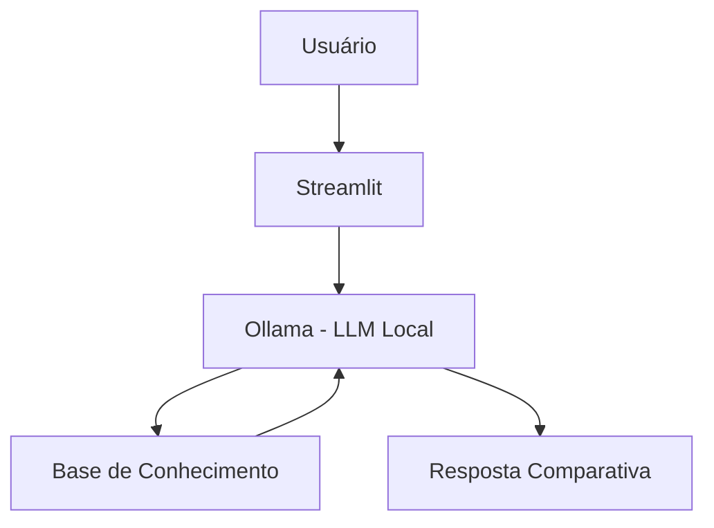

# 🧭 Bússola - Assistente de Destinos para Nômades Digitais

> Agente de IA Generativa que ajuda nômades digitais a escolherem o próximo destino para viver e trabalhar remotamente, comparando custo de vida, internet, visto, segurança e comunidade com base no perfil e histórico de cada pessoa.

## 💡 O Que é o Bússola?

O Bússola é um assistente que **compara e informa**, não decide por você. Ele ajuda a entender as opções — custo de vida, qualidade de internet, tipo de visto, fuso horário, segurança e comunidade nômade — usando uma base de destinos e os dados da própria pessoa usuária como referência.

**O que o Bússola faz:**
- ✅ Compara destinos com base em dados reais da base de conhecimento
- ✅ Usa o perfil e o histórico de viagens da pessoa para personalizar respostas
- ✅ Responde dúvidas sobre custo de vida, internet, visto e comunidade
- ✅ Admite quando não tem dados sobre um destino, em vez de inventar

**O que o Bússola NÃO faz:**
- ❌ Não garante aprovação de visto nem substitui consultoria de imigração
- ❌ Não reserva passagens, acomodações ou qualquer serviço
- ❌ Não substitui a checagem de fontes oficiais atualizadas (embaixadas/consulados)

## 🏗️ Arquitetura



**Stack:**
- Interface: Streamlit
- LLM: Ollama (modelo local `gpt-oss`)
- Dados: JSON/CSV mockados

## 📁 Estrutura do Projeto

```
├── data/                          # Base de conhecimento
│   ├── perfil_nomade.json         # Perfil da pessoa usuária
│   ├── historico_viagens.csv      # Destinos e gastos anteriores
│   ├── historico_atendimento.csv  # Interações anteriores
│   └── destinos_nomades.json      # Destinos nômade-friendly
│
├── docs/                          # Documentação completa
│   ├── 01-documentacao-agente.md  # Caso de uso e persona
│   ├── 02-base-conhecimento.md    # Estratégia de dados
│   ├── 03-prompts.md              # System prompt e exemplos
│   ├── 04-metricas.md             # Avaliação de qualidade
│   └── 05-pitch.md                # Apresentação do projeto
│
└── src/
    └── app.py                     # Aplicação Streamlit
```

## 🚀 Como Executar

### 1. Instalar Ollama

```bash
# Baixar em: ollama.com
ollama pull gpt-oss
ollama serve
```

### 2. Instalar Dependências

```bash
pip install streamlit pandas requests
```

### 3. Rodar o Bússola

```bash
streamlit run src/app.py
```

## 🎯 Exemplo de Uso

**Pergunta:** "Bali ou Chiang Mai, qual combina mais comigo?"
**Bússola:** "Olhando seu perfil: você precisa de internet estável pra chamadas quase diárias e valoriza bastante a comunidade. Bali tem internet melhor (~40 Mbps de média) e uma comunidade gigante, mas custa mais (~US$1.300/mês) e o fuso (UTC+8) fica bem longe do Brasil. Chiang Mai é mais barata (~US$1.000/mês) e também tem comunidade forte, mas a internet média costuma ser um pouco mais instável em algumas áreas. Quer que eu compare o fuso horário de cada uma com seus horários de trabalho?"

**Pergunta:** "Qual foi o lugar mais barato que eu já fiquei?"
**Bússola:** "Olhando seu histórico, Tbilisi foi seu destino mais econômico: US$1.350 no total entre maio e julho. Chiang Mai vem logo depois, com US$1.500. Quer que eu veja se algum lugar novo pode ficar ainda mais em conta?"

## 📊 Métricas de Avaliação

| Métrica | Objetivo |
|---------|----------|
| **Assertividade** | O agente responde o que foi perguntado, usando os dados certos? |
| **Segurança** | Evita inventar dados de destinos ou vistos (anti-alucinação)? |
| **Coerência** | A resposta é adequada ao perfil e histórico da pessoa? |

## 🎬 Diferenciais

- **Personalização:** Usa o perfil e o histórico de viagens da própria pessoa nas comparações
- **100% Local:** Roda com Ollama, sem enviar dados para APIs externas
- **Honesto:** Admite quando não tem dados sobre um destino, em vez de inventar
- **Seguro:** Trata informação de visto como ponto de partida, nunca como garantia legal

## 📝 Documentação Completa

Toda a documentação técnica, estratégias de prompt e casos de teste estão disponíveis na pasta [`docs/`](./docs/).

## 🙏 Créditos

Projeto desenvolvido para o Lab "Construa Seu Assistente Virtual Com Inteligência Artificial" da [DIO](https://github.com/digitalinnovationone/dio-lab-bia-do-futuro), adaptando o tema do repositório de referência (educação financeira) para o contexto de nômades digitais pelo mundo.
