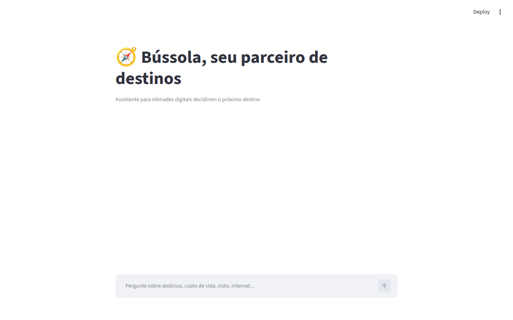

# Passo a Passo de Execução

## Setup do Ollama

```bash
# 1. Instalar Ollama (ollama.com)
# 2. Baixar um modelo leve
ollama pull gpt-oss

# 3. Testar se funciona
ollama run gpt-oss "Olá!"
```

## Código Completo

Todo o código-fonte está no arquivo `app.py`.

## Como Rodar

```bash
# 1. Instalar dependências
pip install streamlit pandas requests

# 2. Garantir que Ollama está rodando
ollama serve

# 3. Rodar o app (a partir da raiz do repositório)
streamlit run src/app.py
```

## Evidência de Execução

A interface sobe normalmente com Streamlit (título, contexto e campo de chat funcionando). Para respostas reais do Bússola, é necessário ter o Ollama rodando localmente com o modelo `gpt-oss` baixado — sem isso, o app mostra uma mensagem de erro amigável em vez de travar.


